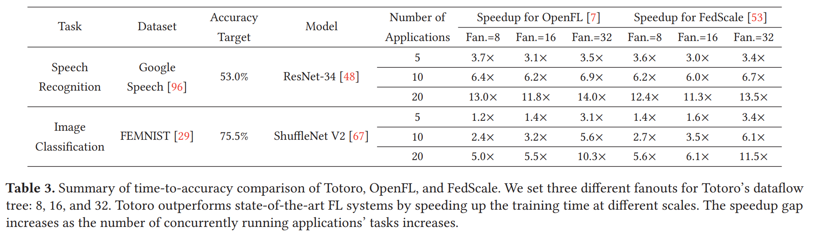

# Totoro Artifact for "Totoro: A Scalable Federated Learning Engine for the Edge [[paper](https://cwching-ucsc.github.io/files/24_eurosys.pdf)]"

## Abstract

Federated Learning (FL) is an emerging distributed machine learning (ML) technique that enables in-situ model training and inference on decentralized edge devices. We propose Totoro, a novel scalable FL engine, that enables massive FL applications to run simultaneously on edge networks. The key insight is to explore a distributed hash table (DHT)-based peer-to-peer (P2P) model to re-architect the centralized FL system design into a fully decentralized one. In contrast to previous studies where many FL applications shared one centralized parameter server, Totoro assigns a dedicated parameter server to each individual application. Any edge node can act as any application’s coordinator, aggregator, client selector, worker (participant device), or any combination of the above, thereby radically improving scalability and adaptivity. Totoro introduces three innovations to realize its design: a locality-aware P2P multi-ring structure, a publish/subscribebased forest abstraction, and a bandit-based exploitationexploration path planning model. Real-world experiments on 500 Amazon EC2 servers show that Totoro scales gracefully with the number of FL applications and $N$ edge nodes, speeds up the total training time by $1.2\times−14.0\times$, achieves $O(\log{N})$ hops for model dissemination and gradient aggregation with millions of nodes, and efficiently adapts to the practical edge networks and churns.

## Totoro Design

Totoro has three layers as shwon in Figure 3:

- Layer 1: **Locality-aware P2P multi-ring structure**.
- Layer 2: **Publish/subscribe-based forest abstraction**.
- Layer 3: **High-level API**.

<p align="center">

</p>

## Main Results

- We compare Totoro with both OpenFL and FedScale PEFT for training many concurrently running FL applications, using ResNet-34 and ShuffleNet-V2.

<p align="center">

</p>

- Comparing time-to-accuracy performance.

<p align="center">

</p>

## Citations

```bibtex
@inproceedings{10.1145/3627703.3629575,
author = {Ching, Cheng-Wei and Chen, Xin and Kim, Taehwan and Ji, Bo and Wang, Qingyang and Da Silva, Dilma and Hu, Liting},
title = {Totoro: A Scalable Federated Learning Engine for the Edge},
year = {2024},
isbn = {9798400704376},
publisher = {Association for Computing Machinery},
address = {New York, NY, USA},
url = {https://doi.org/10.1145/3627703.3629575},
doi = {10.1145/3627703.3629575},
booktitle = {Proceedings of the Nineteenth European Conference on Computer Systems},
pages = {182–199},
numpages = {18},
location = {Athens, Greece},
series = {EuroSys '24}
}
```


